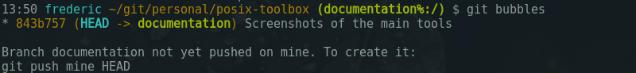
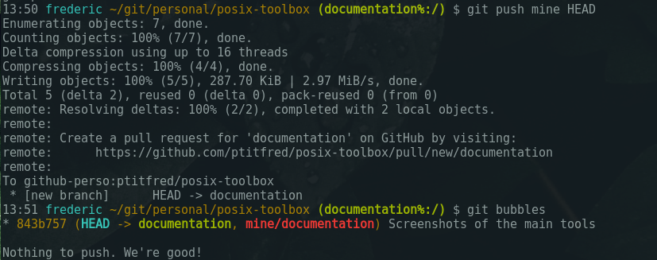
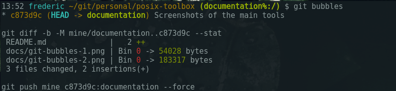
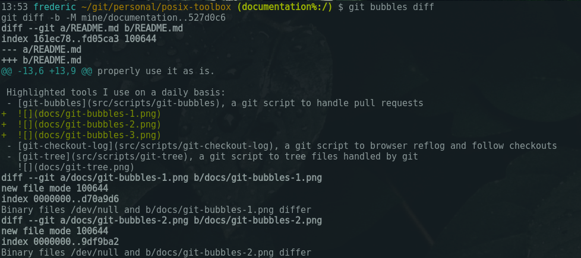
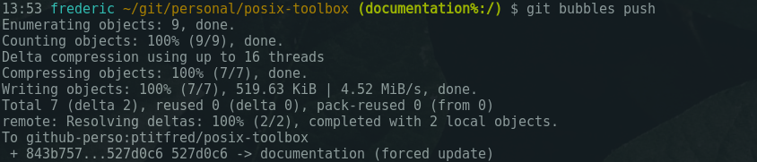
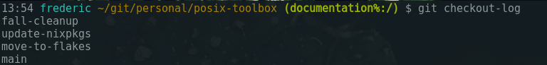
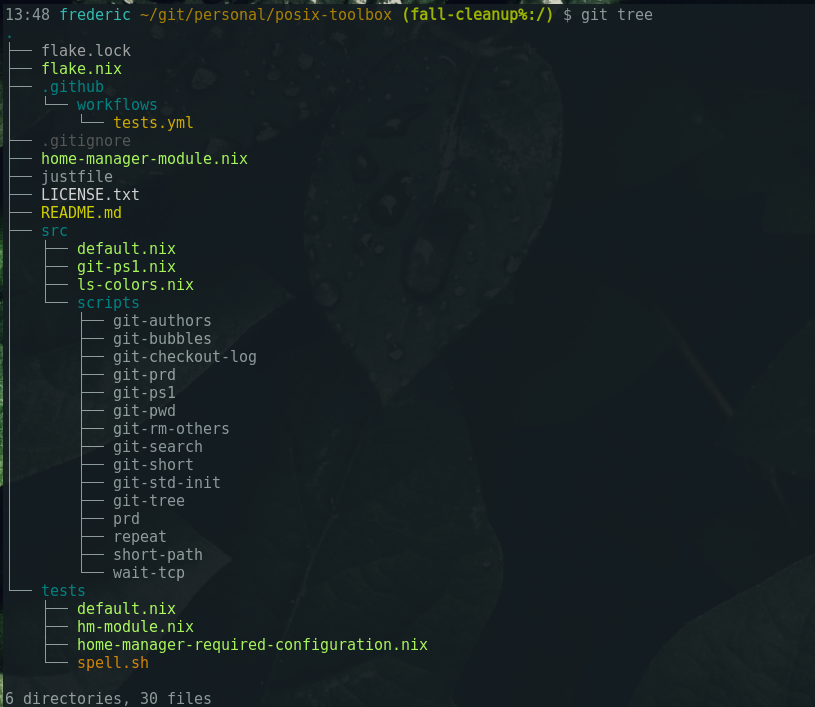

# posix-toolbox

## About

A collection of Unix scripts to ease my life. Mostly around git.

It's very personal and you might find some ideas in it but I doubt anybody would
properly use it as is.

## What's in the toolbox

Highlighted tools I use on a daily basis:
- [git-bubbles](src/git-bubbles/git-bubbles.sh), a git script to handle pull requests
  <div>
    
    
    
    
    
  </div>
- [git-checkout-log](src/git-checkout-log/git-checkout-log.sh), a git script to browser reflog and follow checkouts
  <div>
    
  </div>
- [git-tree](src/git-tree/git-tree.sh), a git script to tree files handled by git
  <div>
    
  </div>
- [wait-tcp](src/wait-tcp/wait-tcp.sh), a script to wait for some server sockets to be opened on a TCP

2 source-able bash scripts to customize your terminal:
- [git-ps1](src/git-ps1/git-ps1.sh), a PS1 expression, mostly focusing on handling git
- [ls-colors](src/ls-colors.nix), a LS_COLORS env var, built from [trapd00r's LS_COLORS](https://github.com/trapd00r/LS_COLORS)

Other scripts live alond but I don't use them directly, [see below](#other-scripts).

## How-to install

This project relies on [nix](https://nixos.org), and [flakes must be enabled](https://nixos.wiki/wiki/Flakes#Enable_flakes).

### Install via home-manager as a module

I'm using [home-manager](https://nix-community.github.io/home-manager/index.html#ch-nix-flakes) for my whole setup and this is therefore my recomended way to use it. It's the best supported way to use it as it sources scripts for you:

```nix
{
  inputs = {
    home-manager.url = "github:nix-community/home-manager/release-25.11";
    ptitfred-posix-toolbox.url = "github:ptitfred/posix-toolbox";
  };

  outputs = { home-manager, ptitfred-posix-toolbox }: {
    homeManagerConfigurations.frederic = home-manager.lib.homeManagerConfiguration {
      modules = [
        ptitfred-posix-toolbox.homeManagerModules.default
        ./your-home.nix
      ];
    };
  }
}
```

The `your-home.nix` file might contain:

```nix
{ ... }:

{
  ptitfred.posix-toolbox.enable = true;

  # Options for the git-bubbles script:
  ptitfred.posix-toolbox.git-bubbles.remote-name = "some-remote-name";
  ptitfred.posix-toolbox.git-bubbles.pattern = "---";

  # You might have to enable git though:
  programs.git.enable = true;

  # If you have bash enabled ls-colors and git-ps1 are sources:
  programs.bash.enable = true;
}
```

You could then use it on your machine with the switch command:

```bash
nix run home-manager/release-25.11 -- switch --flake .#frederic
```

You can learn more about home-manager via [their official documentation](https://nix-community.github.io/home-manager)
or by examples via [my own configuration](https://github.com/ptitfred/personal-infrastructure).

### Install via a profile

A more imperative approach: you can install it in your user's path this way:

```bash
nix profile install github:ptitfred/posix-toolbox
```

It doesn't source the PS1 for you nor the bash colors though. Shame!

### Test from a shell

If you want to poke around and try the scripts, you can launch a shell as a temporary setup:

```bash
nix shell github:ptitfred/posix-toolbox
```

## Other scripts

Other scripts I used to use or are used here:
- [git-authors](src/git-authors/git-authors.sh), a git script to list committers other a commit range
- [git-prd](src/git-prd/git-prd.sh), a git script to display the path of the root of a git repository relative to your HOME directory
- [git-pwd](src/git-pwd/git-pwd.sh), a git script to display the path relative to the root of a git repository
- [git-rm-others](src/git-rm-others/git-rm-others.sh), a git script to clean the working copy from untracked files
- [git-search](src/git-search/git-search.sh), a git script to search the diff other a commit range
- [git-short](src/git-short/git-short.sh), a git script to display short SHA1 of a given commit
- [git-std-init](src/git-std-init/git-std-init.sh), a git script to setup a repository with an initial empty commit and a base and master branches
- [prd](src/prd/prd.sh), a script to print the working directory relative to your HOME directory
- [repeat](src/repeat/repeat.sh), a script to repeat a command some times
- [short-path](src/short-path/short-path.sh), a script to abbreviate every directory unless the last part of a path

Those scripts can be installed by the home-manager module with the `ptitfred.posix-toolbox.extras` flag.

* * *

Copyright &copy; 2010-, Frédéric Menou and Céline Louvet. Licensed under [MIT License].

[MIT License]: https://github.com/ptitfred/posix-toolbox/raw/master/LICENSE.txt
